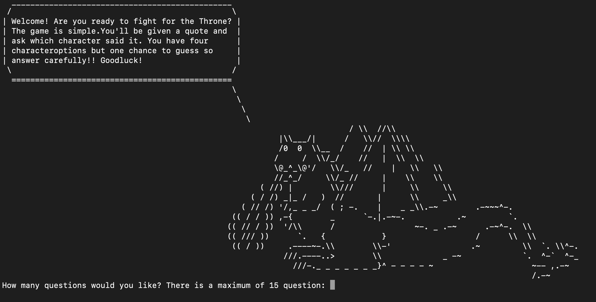

## Attribution to referenced sources

## Link to source control repository
https://github.com/psonkom20/PanisaraSonkom_T1A3/tree/main/python/PanisaraSonkom_T1A3
## Code Styling convention
For this python terminal application I applied the pep 8 coding style. The link below is the guideline I used for my code.
https://peps.python.org/pep-0008/

## List of Features used in the applications
### 1. Select number of questions

This is the first feature user will come across when they start the game. This feature with prompt user to input the number of questions they want and retrieve that number from the question bank. To enable this I assigned the user input (user_number_question_per_quiz) and the dictionary which hold all the questions, answer, and alternative choices to the prep_char_question function which hold the code to get an amount of item from the dictionary. Sequentially the user input was assigned to k which was use to retieve the amount of random questions user wanted through the sample function from import random.

I also implemented error handling to this feature which will prompt user to input the number of questions they want again if their input was out of range or a string. The reason I implemented this feature is to increase user interactiveness.
### 2. Randomise questions and its choice order
This feature enable the quiz to display the game's question in different order everytime they play it. In the case that user ask for a number of question which is less than the amount of available question, each time the player 'play again' it will retrieve different questions from the first time they play. Further, this feature also randomise the order of alternate choices so that when a player 'play again' the correct choice is assigned to a different alphabetical label. To implement this feature import random sample function was used as it allowed user to retreive specific of item from a list while at the same time randomise the retrieved item. To randomised the alternative choice I imported 'ascii_uppercase' to assigned label to the alternative choice retreived. This is because if I assigned the label to my list of alternatives in the dictionary, when implementing randomise, it will change to order of the alphabetical order. To ensure that the user's answer is equal to the choice when its in a randomise condition, I place the correct answer of every questions as the first item of the list.

### 3. Allow user to play again
This feature allows user to play again or quit. To do this I loop the game back to the new_game() which hold the code to execute the game.

## Implementation plan
This project use Trelloboard to manage implementation plan. Link:

